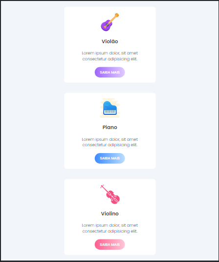

# 📋 Indíce

- [Bem-vindo](#id01)
- [Proposta](#id02)
  - [O desafio](#id02.1)
  - [Objetivo](#id02.2)
- [Meu processo](#id03)
  - [Construção do site](#id03.1)
  - [Aprendizado](#id03.2)
  - [Prosseguimento](#id03.3)
- [Screenshots](#id04)
- [Links](#id05)
- [Tecnologias utilizadas](#id06)
- [Pré-requisitos](#id07)
- [Procedimentos de instalação](#id08)
- [Autora](#id09)

# Bem-vindo! 👋 <a name="id01"></a>

**Cards Responsivos.**

Criação de cards responsivos em HTML e CSS.  

# 🚀 Proposta <a name="id02"></a>

Em todo projeto tenho um prazo de entrega:
<br />

Data inicial: 17/10/2022

Data final: 21/10/2022
<br />

## :trophy: O desafio <a name="id02.1"></a>

<br />

Os usuários devem ser capazes de: 

- Visualizar os cards na versão desktop e responsiva

<br />

## :trophy: Objetivo <a name="id02.2"></a>

<br />

- Praticar projetos em HTML e CSS.

<br />

# 👩🚀 Meu processo <a name="id03"></a>

<br />

5 dias para concluir o projeto

## :trophy: Construção do site <a name="id03.1"></a>

1. Criação do index.html
2. Criação da pasta assets 
3. Criação da pasta css com arquivo style.css
4. Criação da pasta img com ícones 

Dentro da pasta `/design` está o design do projeto. 

## :trophy: Aprendizado <a name="id03.2"></a>

- Responsividade
- Flexbox

## :trophy: Prosseguimento <a name="id03.3"></a>

- Estudos em Lógica de Programação

<br />

# :camera_flash: Screenshots <a name="id04"></a>

<br />

## :desktop_computer: Desktop design


## :iphone: Mobile design



<br />

# :heavy_check_mark: Links <a name="id05"></a>

<br />

- Clique no link para acessar a página: 

<br />

# 🛠 Tecnologias utilizadas <a name="id06"></a>

<br />

- HTML5
- CSS3

<br />

# ☑️ Pré-requisitos <a name="id07"></a>

<br />

- [x] Editor de código de sua preferência (recomendado VS code)
- [x] Git

<br />

# 📝 Procedimentos de instalação <a name="id08"></a>

<br />

Clone este repositório usando o comando:

```bash
git clone https://github.com/RaizaCirne/cards-responsivos.git
```

Baixar arquivo zip 

Extrir arquivos

Abrir pasta no editor de código.

<br />

# :sunglasses: Autora <a name="id09"></a>

<br />

- Personal Page - [Raíza Cirne Braz]()
- Frontend Mentor - [@RaizaCirne](https://www.frontendmentor.io/profile/RaizaCirne)
- GitHub - [RaizaCirne](https://github.com/RaizaCirne)
- LinkedIn - [Raíza Cirne Braz](https://www.linkedin.com/in/ra%C3%ADzacirne/)

**HTML - CSS** 🚀

